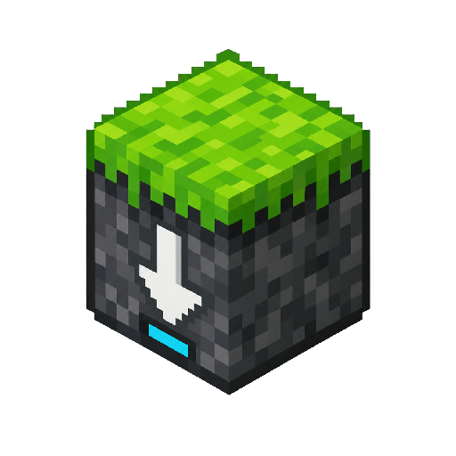

<p align="center">
  
</p>

# MCBE GDK Installer

Minecraft Bedrock GDK builds installer on Linux with working Xbox authentication.

> Compatibility engine source and releases:
> [mcbe-gdk-engine](https://github.com/veedy-dev/mcbe-gdk-engine).

## What it does

- Accepts `.zip`, `.msixvc`, or `.msixv` packages
- Provides a desktop UI for installation, account login, and launching
- Notifies you about installer and compatibility-engine updates
- Decrypts `/LT` test-crypted development packages entirely on Linux
- Installs the latest verified MCBE-compatible GDK-Proton xuser engine
- Opens Microsoft device-code sign-in automatically when needed
- Launches through `umu`
- Keeps its profile separate from other Minecraft installations
- Installs XDG entries for the installer and Minecraft Bedrock

> [!IMPORTANT]
> This project does not include Minecraft files, credentials, licenses,
> decryption keys, or DRM bypasses. You must have authorized access to the
> build and Microsoft GDK.

## Requirements

### Command-line installation and launch

- x86_64 Linux
- Python 3 and `cryptography`
- `curl`, `tar`, `sha256sum`, and `flock`
- `unzip` and `7z` only when installing from a package

You can install the game, sign in, and launch it entirely from the terminal.
GTK is not required. The login command always prints the Microsoft sign-in URL
and code.

### Optional desktop UI

The graphical installer also needs GTK4, Libadwaita, and PyGObject. `qrencode`
is optional and shows a QR code during sign-in. The commands below install
everything needed for both terminal and graphical use.

### Arch Linux

```bash
sudo pacman -S --needed \
  gtk4 libadwaita python python-gobject python-cryptography \
  qrencode curl tar unzip 7zip
```

### Fedora

```bash
sudo dnf install \
  gtk4 libadwaita python3 python3-gobject python3-cryptography \
  qrencode curl tar unzip p7zip p7zip-plugins
```

### Ubuntu / Debian

```bash
sudo apt update
sudo apt install \
  python3 python3-gi gir1.2-gtk-4.0 gir1.2-adw-1 \
  python3-cryptography qrencode curl tar unzip 7zip
```

## Install

### Graphical installer

This command installs the required packages, downloads the latest release, and
opens the graphical installer:

```bash
curl -fsSL https://raw.githubusercontent.com/veedy-dev/mcbe-gdk-installer/main/bootstrap.sh | bash
```

### Download the source

```bash
git clone https://github.com/veedy-dev/mcbe-gdk-installer.git
cd mcbe-gdk-installer
```

To open the graphical installer, run:

```bash
./gui.sh
```

For terminal-only use, choose one of the methods below instead.

## Use

Choose the authorized `.zip`, `.msixvc`, or `.msixv`, then click **Install**.
The installer selects the latest engine release, verifies its checksum, extracts
the public GDK test key locally, decrypts the package, and installs it.
The first run temporarily downloads the official Microsoft GDK archive.
Installing a newer build replaces only the game files; the isolated account,
worlds, and profile data are preserved.

In the UI, click **Sign in**. Scan the QR code or open the displayed URL, then
enter the Microsoft device code. Click **Launch** when the account is
connected.

When an installer or engine update is available, a banner appears above the
Package section. Select **Review** to read the release changelog, then choose
**Install updates** or **Later**. Minecraft, worlds, settings, and account data
are preserved.

The app is also available as **MCBE GDK Installer** in compatible
application launchers. Desktops that group XDG categories place it under
**Games**; launchers used with Hyprland usually expose it through search.

## Command-line install

### Install from a package

Give the installer your `.zip`, `.msixvc`, or `.msixv` package:

```bash
./easy-install.sh "/path/to/Minecraft-package.msixvc"
```

### Use Minecraft files you already have

If you already have the game files, find the folder containing
`Minecraft.Windows.exe` and give that folder to the installer:

```bash
./install.sh "/path/to/Minecraft for Windows/Content"
```

If you know the game version, you can include it:

```bash
./install.sh "/path/to/Minecraft for Windows/Content" --version 1.26.32.2
```

The installer uses the files where they are instead of making another copy.
Back them up first because setup changes some game files. It then downloads the
required runtime, creates a separate profile, and adds the terminal commands to
`~/.local/bin`.

After installation, sign in and launch without opening the setup UI:

```bash
mcbe-gdk-linux-login
mcbe-gdk-linux
```

Use `mcbe-gdk-linux-auth` to check account status and
`mcbe-gdk-linux-logout` to remove the saved account. If your terminal reports
that a command was not found, run it from `~/.local/bin`.

Rerun the same installation command after `git pull` to update an existing
installation.

Set `MCBE_GDK_ENGINE_RELEASE=vX.Y.Z` to install a specific engine release for
testing or rollback.

## Commands

| Purpose | Command |
| --- | --- |
| Open setup UI | `./gui.sh` or `mcbe-gdk-linux-gui` |
| Package-to-Linux setup | `./easy-install.sh /path/to/mcbe-gdk-build.msixvc` |
| Launch Minecraft | `mcbe-gdk-linux` |
| Check Xbox account | `mcbe-gdk-linux-auth` |
| Sign in | `mcbe-gdk-linux-login` |
| Sign out | `mcbe-gdk-linux-logout` |
| Remove launchers | `./uninstall.sh` |

## Documentation

- [Native `/LT` package extraction](docs/DECRYPTION.md)
- [Compatibility engine source](https://github.com/veedy-dev/mcbe-gdk-engine)
- [Troubleshooting](docs/TROUBLESHOOTING.md)

## Engine source

The compatibility engine source, build workflow, and release provenance live in
[mcbe-gdk-engine](https://github.com/veedy-dev/mcbe-gdk-engine).
Authentication and prefix setup use a pinned, MIT-licensed subset of
[BedrockOnLinux](https://github.com/Wyze3306/BedrockOnLinux). Its launcher,
AppImage, GUI, and game-management code are not installed.

## License

The installer and documentation are MIT licensed. Vendored and runtime
components retain their upstream licenses. This project is unofficial and is
not affiliated with Microsoft or Mojang.
